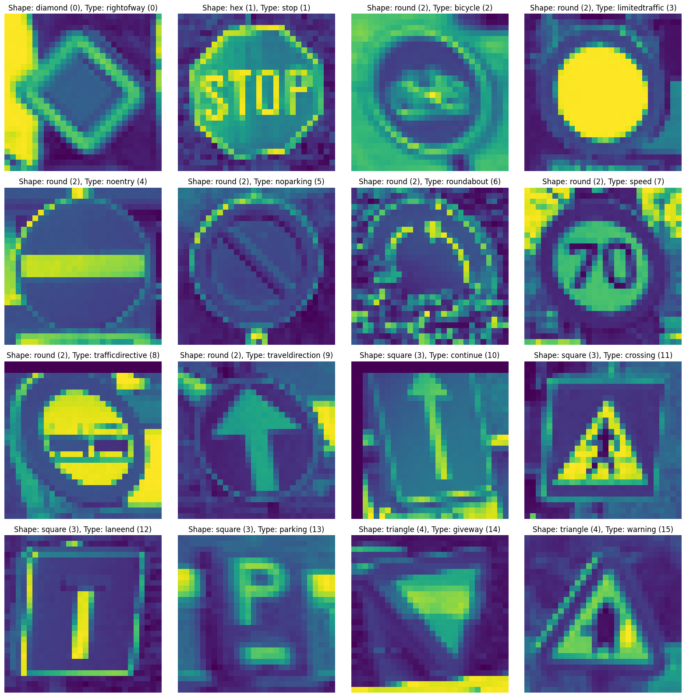

# 🙋‍♀️ Authors: s3959666-s3961136-a2

Group 9
- s3961136 Benjaporn Wongmayura
- s3959666 Xiaohan Qin

# 🚸 Road Traffic Signs Image Classification using a Neural Network

## 🔗 Table of Contents
1. [About the Project](#about-the-project)
2. [Technology Stack](#technology-stack)
3. [Dataset](#dataset)
4. [Overview](#overview)
5. [Key Steps](#key-steps)
6. [Results](#results)
7. [Highlights](#highlights)
8. [Conclusion](#conclusion)

## 🔭 About the Project
This project involves training a machine learning model to classify grayscale images of European traffic signs by shape and type using a designated dataset. The project requires developing at least one supervised learning algorithm for each classification task, followed by an analysis in a report.

## 🛠 Technology Stack
- 
- 
- 
- 
- 
- 
- 
- 

## 📊 Dataset
Source: Belgium Traffic Sign Classification Benchmark, German TSC dataset

## 🛣️ Overview
This project focuses on classifying road traffic signs to enhance navigation systems and road safety. It explores the use of **Multilayer Perceptron (MLP)** models as baselines and **Convolutional Neural Networks (CNNs)**, including advanced **VGG architectures**, for improved accuracy.

## 🚀 Key Steps
1. **Dataset**: Belgium Traffic Sign Benchmark, categorized into 5 shapes and 16 types.
- Display sample images from each class

- Distribution of the data

2. **Exploratory Data Analysis (EDA):**
   - Observed class imbalances.
   - Addressed using **SMOTE** for data augmentation.
3. **Model Development:**
   - **MLP Models**: Baseline models for quick, foundational insights.
   - **CNNs**: Improved classification using spatial information and hierarchical feature extraction.
   - **VGG Networks**: Deep CNNs providing superior accuracy, incorporating techniques like **Batch Normalization**, **Dropout**, and **hyperparameter tuning**.

## 📈 Results
- **MLP Models**: Practical starting point but limited performance on image data.
- **CNNs**: Significantly improved classification accuracy and robustness.
- **VGG Models**: Demonstrated the best performance and generalization capabilities on both internal and external datasets.

## ✨ Highlights
- **Evaluation Metrics**: Used **F1-score** to ensure reliable performance across all classes.
- **Hyperparameter Tuning**: Optimized regularization and dropout rates for the best results.
- **Advanced Techniques**: Transfer learning and fine-tuning enhanced model robustness.

## 🏁 Conclusion
**CNNs**, especially **VGG-based architectures**, are highly effective for traffic sign classification, outperforming **MLP models** in accuracy and reliability.

